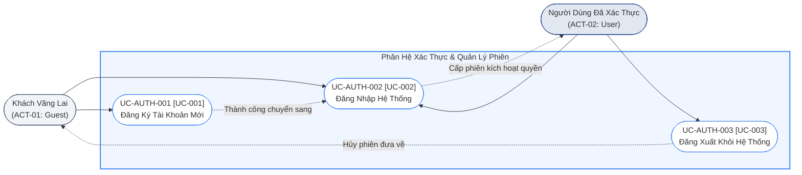

# SƠ ĐỒ CA SỬ DỤNG PHÂN HỆ XÁC THỰC (AUTHENTICATION USE CASES)
## Hệ Thống Website Chatbot Trợ Lý Ảo (AI-Chan Assistant)

---

## 1. Sơ Đồ Ca Sử Dụng Phân Hệ Xác Thực & Định Danh

```mermaid
flowchart LR
    Guest(["Khách Vãng Lai<br/>(ACT-01: Guest)"])
    User(["Người Dùng Đã Xác Thực<br/>(ACT-02: User)"])

    subgraph AuthBoundary ["Phân Hệ Xác Thực & Quản Lý Phiên"]
        UC1(["UC-AUTH-001 [UC-001]<br/>Đăng Ký Tài Khoản Mới"])
        UC2(["UC-AUTH-002 [UC-002]<br/>Đăng Nhập Hệ Thống"])
        UC3(["UC-AUTH-003 [UC-003]<br/>Đăng Xuất Khỏi Hệ Thống"])
    end

    Guest --> UC1
    Guest --> UC2
    
    User --> UC2
    User --> UC3

    UC1 -.->|Thành công chuyển sang| UC2
    UC2 -.->|Cấp phiên kích hoạt quyền| User
    UC3 -.->|Hủy phiên đưa về| Guest

    style AuthBoundary fill:#eff6ff,stroke:#3b82f6,stroke-width:2px
    style UC1 fill:#ffffff,stroke:#3b82f6
    style UC2 fill:#ffffff,stroke:#3b82f6
    style UC3 fill:#ffffff,stroke:#3b82f6
    style Guest fill:#f1f5f9,stroke:#475569
    style User fill:#e2e8f0,stroke:#1e3a8a
```
