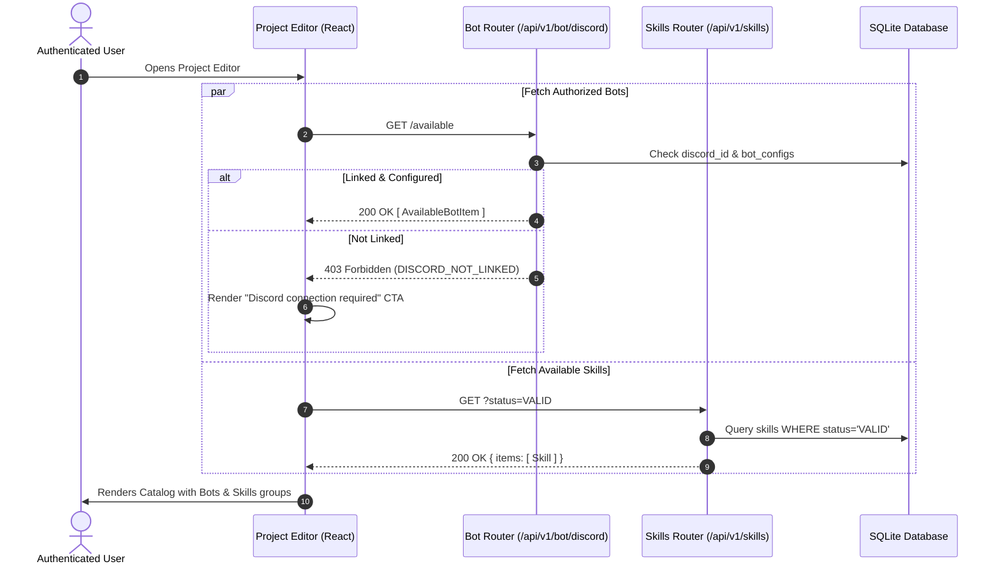
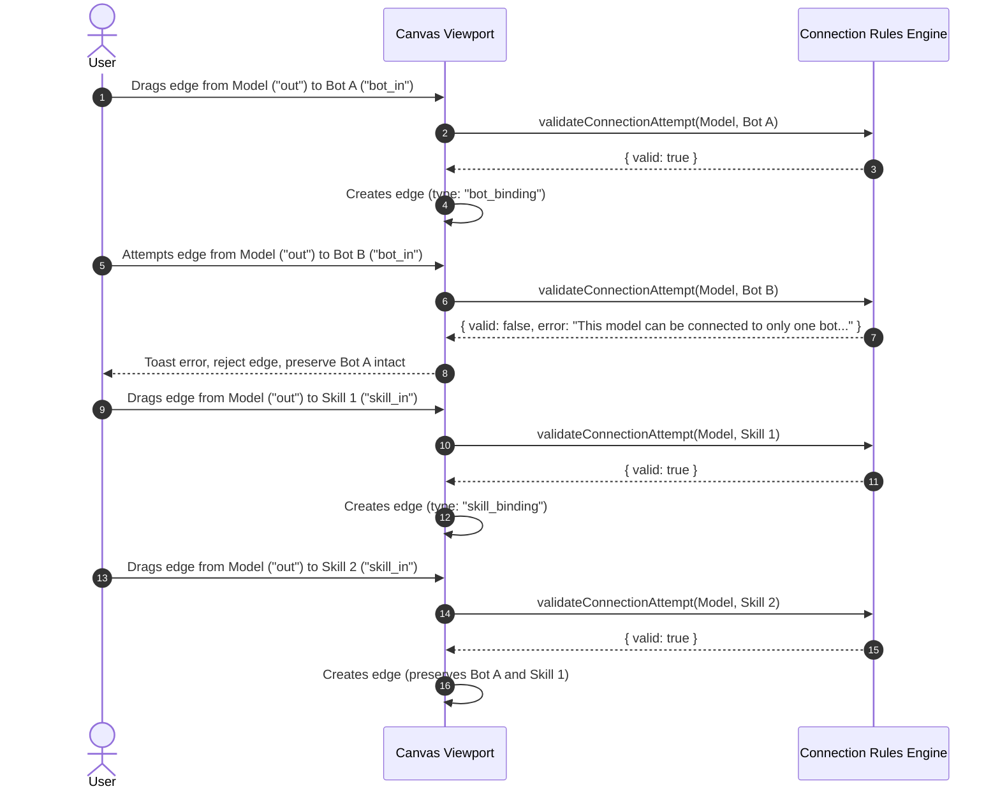
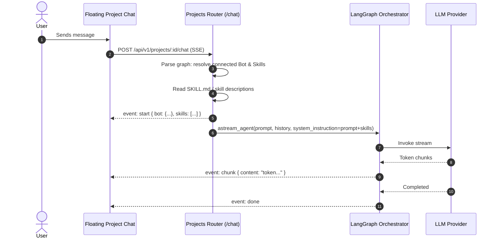

# Diagrams: Project Canvas Bots and Skills

## 1. Catalog Discovery & Dynamic Loading

```mermaid
sequenceDiagram
    autonumber
    actor User as Authenticated User
    participant Editor as Project Editor (React)
    participant BotAPI as Bot Router (/api/v1/bot/discord)
    participant SkillAPI as Skills Router (/api/v1/skills)
    participant DB as SQLite Database

    User->>Editor: Opens Project Editor
    par Fetch Authorized Bots
        Editor->>BotAPI: GET /available
        BotAPI->>DB: Check discord_id & bot_configs
        alt Linked & Configured
            BotAPI-->>Editor: 200 OK [ AvailableBotItem ]
        else Not Linked
            BotAPI-->>Editor: 403 Forbidden (DISCORD_NOT_LINKED)
            Editor->>Editor: Render "Discord connection required" CTA
        end
    and Fetch Available Skills
        Editor->>SkillAPI: GET ?status=VALID
        SkillAPI->>DB: Query skills WHERE status='VALID'
        SkillAPI-->>Editor: 200 OK { items: [ Skill ] }
    end
    Editor->>User: Renders Catalog with Bots & Skills groups
```

## 2. Interactive Connection Validation (Single Bot & Multi Skills)

```mermaid
sequenceDiagram
    autonumber
    actor User as User
    participant Canvas as Canvas Viewport
    participant RuleEngine as Connection Rules Engine

    User->>Canvas: Drags edge from Model ("out") to Bot A ("bot_in")
    Canvas->>RuleEngine: validateConnectionAttempt(Model, Bot A)
    RuleEngine-->>Canvas: { valid: true }
    Canvas->>Canvas: Creates edge (type: "bot_binding")

    User->>Canvas: Attempts edge from Model ("out") to Bot B ("bot_in")
    Canvas->>RuleEngine: validateConnectionAttempt(Model, Bot B)
    RuleEngine-->>Canvas: { valid: false, error: "This model can be connected to only one bot..." }
    Canvas-->>User: Toast error, reject edge, preserve Bot A intact

    User->>Canvas: Drags edge from Model ("out") to Skill 1 ("skill_in")
    Canvas->>RuleEngine: validateConnectionAttempt(Model, Skill 1)
    RuleEngine-->>Canvas: { valid: true }
    Canvas->>Canvas: Creates edge (type: "skill_binding")

    User->>Canvas: Drags edge from Model ("out") to Skill 2 ("skill_in")
    Canvas->>RuleEngine: validateConnectionAttempt(Model, Skill 2)
    RuleEngine-->>Canvas: { valid: true }
    Canvas->>Canvas: Creates edge (preserves Bot A and Skill 1)
```

## 3. Project Chat Execution Runtime

```mermaid
sequenceDiagram
    autonumber
    actor User as User
    participant ChatUI as Floating Project Chat
    participant Backend as Projects Router (/chat)
    participant Agent as LangGraph Orchestrator
    participant Model as LLM Provider

    User->>ChatUI: Sends message
    ChatUI->>Backend: POST /api/v1/projects/:id/chat (SSE)
    Backend->>Backend: Parse graph: resolve connected Bot & Skills
    Backend->>Backend: Read SKILL.md / skill descriptions
    Backend-->>ChatUI: event: start { bot: {...}, skills: [...] }
    Backend->>Agent: astream_agent(prompt, history, system_instruction=prompt+skills)
    Agent->>Model: Invoke stream
    Model-->>Agent: Token chunks
    Agent-->>ChatUI: event: chunk { content: "token..." }
    Model-->>Agent: Completed
    Agent-->>ChatUI: event: done
```
